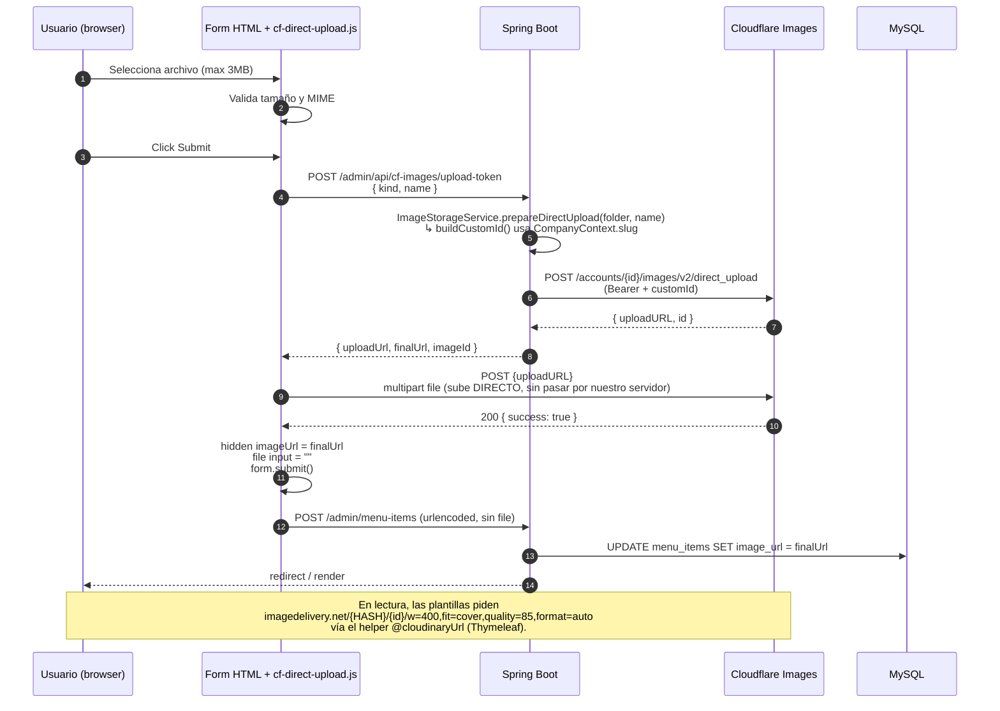

# Migración Cloudinary → Cloudflare Images

> Estado: backend, frontend, Docker y workflow de deploy migrados. Build pasa
> limpio (`mvnw -DskipTests compile`). Falta solo configuración manual de
> Cloudflare y un cleanup de URLs viejas en BD.

---

## 1. Setup manual en Cloudflare (una sola vez)

1. **Crear cuenta** en <https://dash.cloudflare.com>.
2. **Activar Cloudflare Images** (`Images` → `Get started`). Plan inicial: $5/mes
   por 100k imágenes almacenadas + 100k/mes de delivery.
3. **Activar variantes flexibles**:
   `Images` → `Variants` → `Flexible variants` → toggle ON. Sin esto los
   parámetros `?w=400,...` no funcionan.
4. **Crear API Token**:
   - `My Profile` → `API Tokens` → `Create Token` → plantilla
     `Read and write to Cloudflare Stream and Images`.
   - Account Resources: tu cuenta. Permissions: `Account → Cloudflare Images → Edit`.
   - Copia el token que se muestra una sola vez.
5. **Copiar Account ID y Account Hash**:
   - Account ID: barra lateral derecha en cualquier página del dashboard.
   - Account Hash: `Images` → `Overview` (o cualquier `https://imagedelivery.net/<HASH>/<id>/<variant>` ya generada).

## 2. Variables de entorno

```
CLOUDFLARE_ACCOUNT_ID=<account id>
CLOUDFLARE_IMAGES_API_TOKEN=<api token>
CLOUDFLARE_IMAGES_HASH=<account hash>
```

- **Local (`.env` para docker compose)**: añade las 3 líneas y borra las
  antiguas `CLOUDINARY_*`.
- **GitHub Actions**: en `Settings → Secrets and variables → Actions` crea
  `CLOUDFLARE_ACCOUNT_ID`, `CLOUDFLARE_IMAGES_API_TOKEN`, `CLOUDFLARE_IMAGES_HASH`
  y borra las viejas `CLOUDINARY_*`.

`docker-compose.yml` y `.github/workflows/deploy.yml` ya inyectan los nuevos
nombres.

## 3. Limpieza de la BD

URLs viejas de Cloudinary romperán las imágenes. Ejecuta una vez:

```bash
docker exec -i elgransazon_db mysql -uroot -p<PWD> bd_restaurant \
  < cleanup_cloudinary_urls.sql
```

(El script `cleanup_cloudinary_urls.sql` está en la raíz del proyecto.)

---

## 4. Flujo real de subida (Direct Creator Upload)



### Detalle por escenario

| UI                        | tokenUrl                                       | kind             | Custom ID resultante                          |
| ------------------------- | ---------------------------------------------- | ---------------- | --------------------------------------------- |
| Admin · menu items        | `/admin/api/cf-images/upload-token`            | `menu-items`     | `<slug>/menu/<nombre>-<ts>`                   |
| Admin · promociones       | `/admin/api/cf-images/upload-token`            | `promotions`     | `<slug>/promotions/<nombre>-<ts>`             |
| Admin · logo restaurante  | `/admin/api/cf-images/upload-token`            | `restaurant-logo`| `<slug>/logo/restaurant-logo-<ts>`            |
| Programmer · system logo  | `/programmer/api/cf-images/upload-token`       | `system-logo`    | `savorycloud/system-logo-<ts>` (global)       |
| Programmer · landing      | `/programmer/api/landing-images/upload-token`  | `landing`        | `<slug>/landing/<section>-<position>-<ts>`    |

> El controlador **fija el `CompanyContext`** antes de llamar a `prepareDirectUpload`
> en flujos donde el contexto no viene por sesión (acciones del programador
> sobre una empresa seleccionada). Para `system-logo` no se necesita contexto:
> el ID se construye sobre la carpeta global `savorycloud/`.

## 5. Servir / leer imágenes

- Las URLs guardadas en BD son del tipo
  `https://imagedelivery.net/<HASH>/<slug>/<sub>/<name>-<ts>/public`.
- En Thymeleaf, en lugar de imprimir esa URL cruda usa
  `@cloudinaryUrl` (nombre de bean preservado para no tocar plantillas):

  ```html
  
  
  ```

  El helper sustituye el último segmento (`public`) por la string de
  variantes flexibles, p.ej. `w=400,fit=cover,quality=85,format=auto`.

- En JS (`fragments/theme.html`) la función `cloudinaryOptimize(url, params)`
  hace lo mismo pero no toca URLs que no sean de `imagedelivery.net` (legado o
  externas pasan tal cual).

## 6. Borrado

`ImageStorageService.deleteImage(url)` extrae el id de la URL
(`imagedelivery.net/<hash>/<id>/<variant>` → `<id>`) y dispara DELETE asíncrono
contra `/accounts/{accountId}/images/v1/<id>`. No bloquea el request del
usuario y tolera fallos silenciosos (loguea WARN).

## 7. Pendientes futuros (opcionales)

- Renombrar el bean `@cloudinaryUrl` → `@imageUrl` cuando estés listo a
  refactor masivo de plantillas.
- Subir un Worker para validar el tipo MIME en el lado de Cloudflare antes
  del upload (sólo si recibes uploads desde clientes no controlados).
- Configurar `requireSignedURLs=true` para imágenes privadas (no es el caso
  hoy: todo es público).
